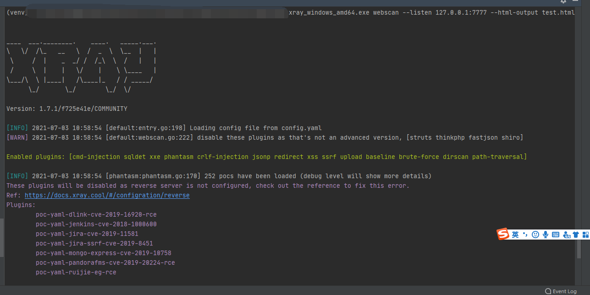
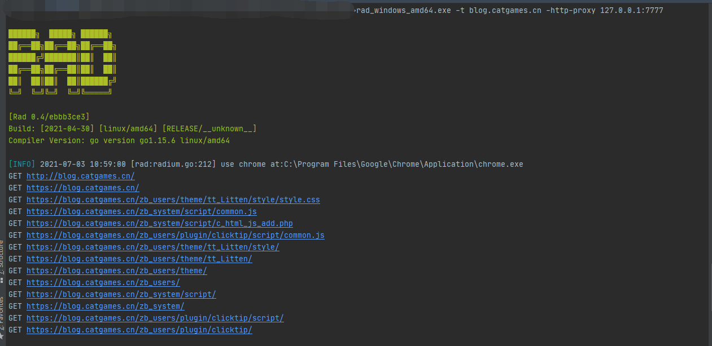
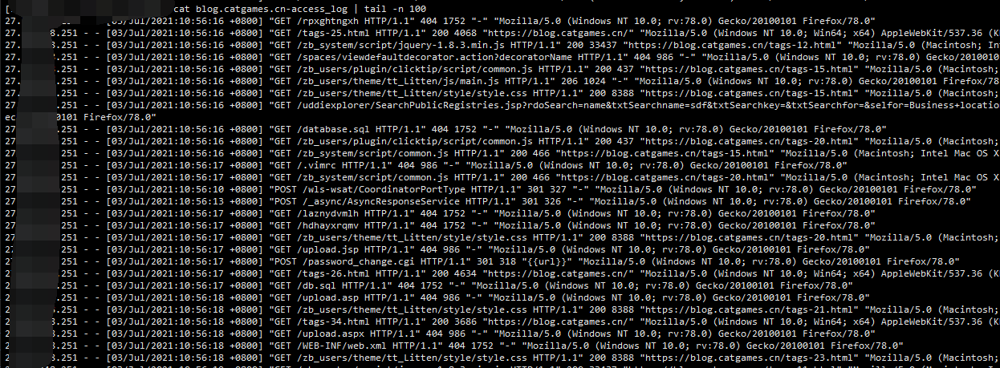
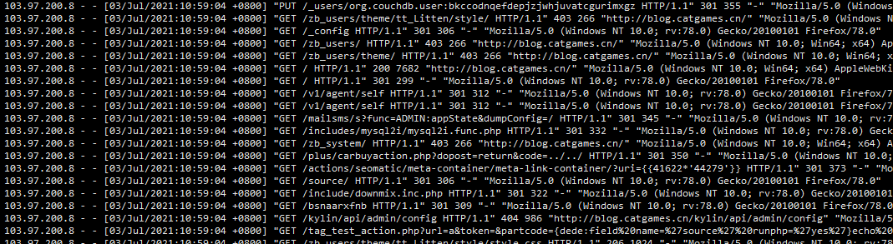
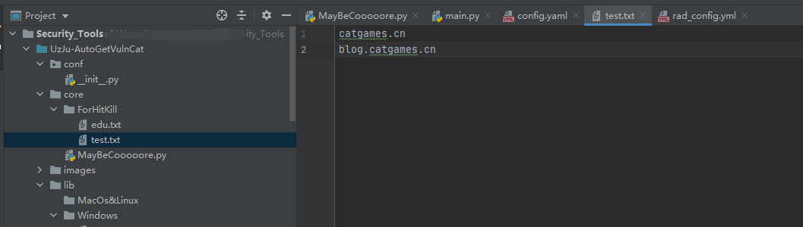
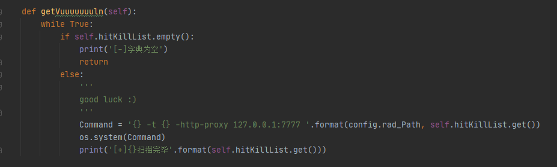
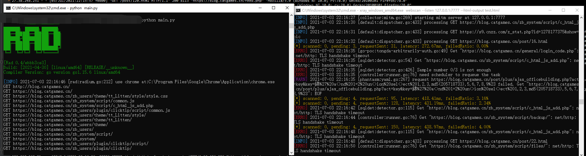
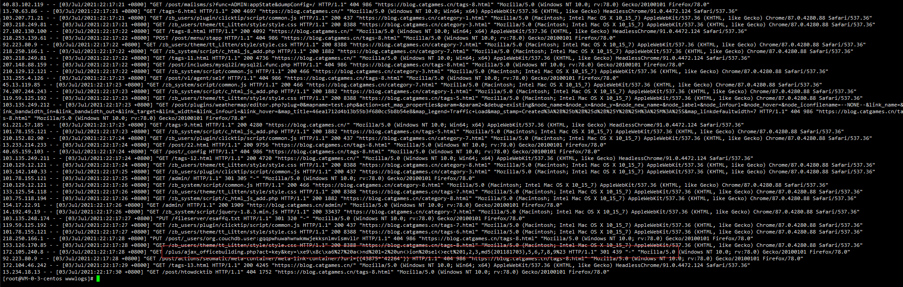
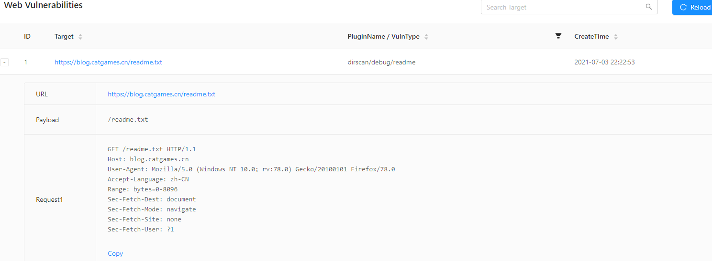

# 如何优雅的自动化挖洞

最近又陆续看到好多自动化挖洞的文章(其实好早以前就有了)，趁着周末，也自己手动搭建一个

所需工具

> Xray：https://github.com/chaitin/xray/
>
> Rad：https://github.com/chaitin/rad/
>
> Python：3.7.6
>
> 防止自爆（建议：要开科技）：你需要一款纸飞机科技或一只猫

## 一、开始单个目标测试

### 1、Xray需要开始监听

```bash
xray_windows_amd64.exe webscan --listen 127.0.0.1:7777 --html-output test.html
```



### 2、Rad联动

```bash
rad_windows_amd64.exe -t blog.catgames.cn -http-proxy 127.0.0.1:7777
```



### 3、没开科技，扫描的日志

> 本机公网IP 自爆卡车



### 4、开启科技，扫描的日志

> 所以你开科技了吗？虽然不能保证百分百不被溯源，有总比没有好吧



## 二、自动化geeeeeeeeeetVuln

用自己的站点测试



### 1、Python自动化

核心代码



> ps：本来想弄个多线程的，就写了queue后来试了一下，你线程跑得再快，xray，那边跑得比较慢，跑得快也只会堆积请求，没啥意义，所以还不如慢慢的来。



然后挂着就可以了，网上还有部分教程可以联动burp，我在github搜了一下，由shiro的一些被动插件

shiro被动检测插件：https://github.com/pmiaowu/BurpShiroPassiveScan

### 2、服务器日志



可以看到开始有一些奇怪的日志了，然后只需要挂机运气等着即可


## 三、如何使用和获取脚本

我的github主页：https://github.com/uzju

获取脚本：https://github.com/UzJu/UzJuAutoGetVulnForXray

### 1、下载Xray和Rad放到跟脚本同一个目录下


### 2、需要扫描的域名列表放在ForHitKill目录下


### 3、Xray开启监听

目前只写了Windows下的，暂时不支持Linux，代码简单，各位大佬可以自行修改（本来就没几行:）

```bash
xray_windows_amd64.exe webscan --listen 127.0.0.1:7777 --html-output test.html
```


### 4、启动

```bash
python3 MayBeCooooore.py
```

祝你好运！

